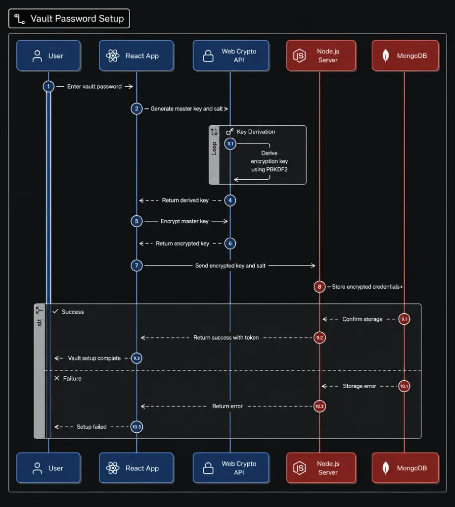

Privacy is no longer just a feature; it’s a fundamental expectation. When building my latest app, *******, I wanted to ensure that my users’ data was completely private. I didn’t just want to promise privacy — I wanted to guarantee it mathematically.

That’s why I decided to implement a Zero-Knowledge End-to-End Encryption (E2EE) architecture.

In a Zero-Knowledge system, the backend server is completely “blind.” It stores the encrypted data and the locked cryptographic keys, but it never possesses the actual password required to unlock and read the user’s data. Even if my entire database is compromised, the data remains unreadable.

***

## E2EE requirement

Transitioning a standard web app into a Zero-Knowledge architecture is like rebuilding an airplane while it’s in the air. Suddenly, you can’t just send plaintext data to the server. You can’t just use a “Forgot Password” link. And most painfully, you have to manage encryption keys safely in the browser.

## The Cryptographic Building Blocks

Before writing any code, I had to understand the keys involved. You can’t encrypt data directly with a user’s password because passwords are too weak and too short.

- **DEK (Data Encryption Key):** A massive, random 256-bit key (AES-GCM). This is the true “Master Key.” Every piece of user data is encrypted and decrypted using this key.
- **KEK (Key Encryption Key):** This key’s sole purpose is to encrypt the DEK. I derived this key from the user’s human-readable Vault Password using a heavy algorithm called PBKDF2 with 250,000+ iterations to prevent brute-force attacks.

***

## The Setup Flow & The Database

When a user sets up their vault, the entire cryptographic heavy lifting happens strictly inside their browser using the native Web Crypto API.



1. The browser generates a random 256-bit DEK.
2. The user types their Vault Password.
3. The browser generates a random userSalt and uses PBKDF2 to derive the KEK from the password.
4. The browser encrypts the DEK using the KEK.
5. The browser sends the encryptedDEK and the userSalt to the backend.

The backend never sees the raw DEK. My Mongoose schema looks like this:

```javascript
crypto: {
    encryptedDEK_pwd: { type: Object }, // The locked Master Key
    userSalt: { type: String },         // Needed to derive the KEK
    pbkdf2Iterations: { type: Number, default: 250000 },
    kdf: { type: String, default: "PBKDF2" },
    lastVaultResetAt: { type: Date }    // Crucial for security (more on this later)
}
```

***

## The React SPA Challenge: Surviving Page Reloads

One of the biggest UX challenges with E2EE in a React SPA is page reloads. If the raw DEK only lives in React State (RAM), a simple page refresh will wipe it out, forcing the user to re-enter their Vault Password constantly.

**The Trade-off: sessionStorage** 
To balance extreme paranoia with modern UX, I utilized a CryptoContext in React. Once the DEK is decrypted, I export it as raw bytes, convert it to a Base64 string, and store it in sessionStorage.

```javascript
// Inside CryptoContext.jsx
const rawKey = await window.crypto.subtle.exportKey("raw", dek);
const base64Key = btoa(String.fromCharCode(...new Uint8Array(rawKey)));
sessionStorage.setItem("workspace_dek", base64Key);
```

Since sessionStorage is strictly tied to the specific tab and is wiped the moment the tab is closed, it prevents the key from persisting indefinitely on disk, providing a level of security similar to WhatsApp Web.

***

## The Final Bosses: 3 Bugs That Almost Broke Me

The hardest part of this journey wasn’t the cryptography — it was the integration of E2EE with standard authentication flows like Google OAuth. Here are the three brutal bugs I fought and conquered:

### Bug #1: The “Existing User” Amnesia
When I integrated Google Auth, I realized that my backend was returning `{ message: "Login successful" }` but omitting the cryptographic keys for existing users. The React frontend, seeing no keys, assumed the user was new and forcefully redirected them to the "Create Vault" screen, even if they already had one! 
**The Fix:** I updated the Google Auth controller to properly nest and return the `cryptoKeys` object from the database so the frontend could seamlessly switch to the "Unlock Vault" screen instead.

### Bug #2: The Cookie maxAge Discard
I noticed that Email Login worked perfectly, but Google Login kept kicking users out when they refreshed the page. After hours of debugging, I found the culprit: I forgot to add `maxAge: 7 Days` to the Google Auth Set-Cookie header. The browser treated it as a temporary session cookie and ruthlessly discarded it during hard redirects between the SPA routes.

### Bug #3: The “Time-Sync” Paradox (My Favorite Bug)
This was the most mind-bending bug of the entire project. I had built a security feature where updating the Vault Password updates a `lastVaultResetAt` timestamp in the database. My `authMiddleware` would automatically reject any JWT tokens that were issued before that timestamp to prevent session hijacking.

But during a new Google OAuth signup flow, users were getting instantly kicked out with a `401 Unauthorized` error! 

Why?
1. Google Auth generated a JWT token at 10:00:00.
2. The user took 10 seconds to think of and type a new Vault Password on the frontend.
3. The vault was created at 10:00:10, and the backend updated `lastVaultResetAt` to 10:00:10.
4. The middleware checked the JWT. Since 10:00:00 < 10:00:10, my own security system assumed the token was stolen prior to a password reset and kicked the user out!

**The Fix:** I had to explicitly re-issue a fresh JWT token at the exact moment the Vault was set up, ensuring the token’s `iat` (issued at) time synced perfectly with the vault creation time.

## Conclusion

Building a Zero-Knowledge E2EE application is a wild ride. You lose the ability to reset passwords easily, state management becomes a minefield, and integrating third-party auth requires meticulous care.

However, in an era where data breaches make headlines weekly, having a system where you can look your users in the eye and say, “Even if I wanted to, I cannot read your data,” is a uniquely powerful feeling.

If you’re building a privacy-first app, I highly recommend diving into the Web Crypto API. The journey is tough, but the destination is absolutely worth it.

*Tags: [React](#), [Node.js](#), [Cybersecurity](#), [Web Development](#), [Cryptography](#)*
